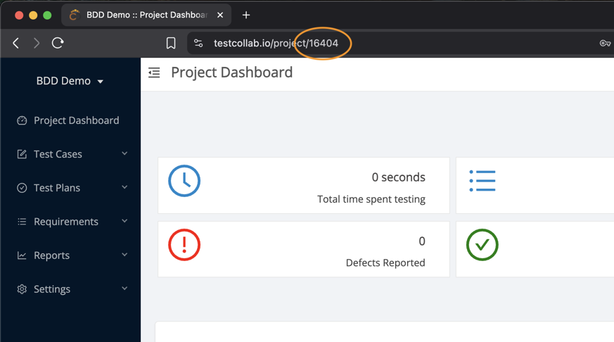
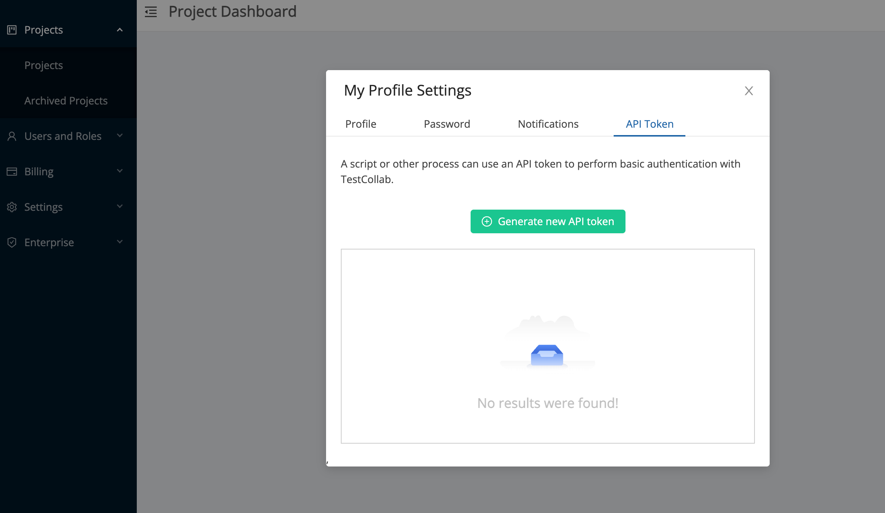
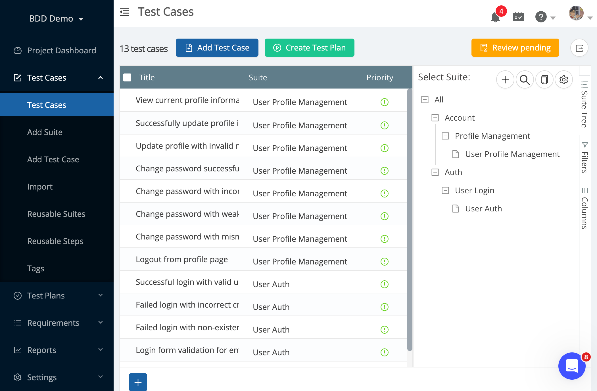

# TestCollab BDD Demo Project

This is a sample project demonstrating how to use the TestCollab CLI for Git-based synchronization of Gherkin feature files with TestCollab projects.

## Project Overview

This demo includes:
- A simple single-page web application with login and profile management features (only for reference, no need to run it)
- Gherkin feature files that describe the application's behavior using BDD syntax
- A Git repository with proper commit history to demonstrate change detection
- Complete instructions for using the TestCollab CLI with local development

## Quickstart

1. Fork this repo (recommended) or clone to your local machine.

2. Create a new project on Test Collab and note the project ID. Locate your project ID in the TestCollab web UI:

   

3. Create a new API token that will be used to sync .feature files. Click on your user on top right > My profile settings > API token. Click on generate and copy the token.

   

4. Go to your new forked / cloned repo and run this:

   ```bash
    export TESTCOLLAB_TOKEN=abcdef...
    npx testcollab-cli sync --project {projectId}
    ```

You should see something like this:

   ```bash
   🔍 Fetching sync state from TestCollab...

   📊 Last synced commit: none (initial sync)

   📊 Current HEAD commit: 2d22cc08f26decc5732e3386b3ee61a206b5d3ac

   🔍 Analyzing changes...

   ...

   🚀 Syncing with TestCollab...

   📊 Synchronization Results:

   ✅ Synchronization completed successfully
   ```

And if you go to your test cases page in project now, you should see all test cases and test suites created:



## Project Structure

```
testcollab-bdd-demo/
├── README.md                    # This documentation
├── index.html                   # Simple web application
├── style.css                    # Basic styling
├── script.js                   # Application logic
├── .gitignore                   # Git ignore file
└── features/                    # Gherkin feature files
    ├── auth/
    │   └── user_login.feature   # Authentication scenarios
    └── account/
        └── profile_management.feature  # Profile management scenarios
```

To understand how the test suite tree is created, check out any feature file and compare that to above synced test case page screenshot.


## Using with TestCollab CLI

    ```bash
    npx testcollab-cli --help
    ```

You can install it as global package:

    ```bash
    npm install -g testcollab-cli
    tc --help
    tc sync --project 1234
    ```


### Prerequisites

1. **TestCollab CLI setup**: Ensure you have the TestCollab CLI available locally
2. **API Token**: Set your TestCollab API token as an environment variable
3. **TestCollab Project**: Have a TestCollab project ID ready

### Environment Setup

```bash
# Set your TestCollab API token
export TESTCOLLAB_TOKEN=your_api_token_here

# For Windows
set TESTCOLLAB_TOKEN=your_api_token_here
```

### CLI Usage Examples

#### Option 1: From npx


```bash
# Navigate to the demo project
cd /path/to/testcollab-bdd-demo

# Run initial sync
npx testcollab-cli sync --project YOUR_PROJECT_ID

# Example with specific API URL
npx testcollab-cli sync --project YOUR_PROJECT_ID --api-url https://your-api.testcollab.io
```

#### Option 2: Installing as npm package

If you've installed the CLI as global package:

```bash
npm install -g testcollab-cli
```

```bash
cd testcollab-bdd-demo
tc sync --project YOUR_PROJECT_ID
```

### Demo Workflow

1. **Initial Sync**: Run the CLI to perform the first synchronization
   ```bash
   node /path/to/cli2/src/index.js sync --project YOUR_PROJECT_ID
   ```

2. **Make Changes**: Edit feature files to see change detection in action
   ```bash
   # Edit a feature file
   vim features/auth/user_login.feature
   
   # Commit changes
   git add features/auth/user_login.feature
   git commit -m "Update login scenarios"
   ```

3. **Sync Changes**: Run CLI again to sync the modifications
   ```bash
   tc sync --project YOUR_PROJECT_ID
   ```

4. **Observe Results**: Check the CLI output for sync statistics

### Expected CLI Output

#### Initial Sync
```
🔍 Fetching sync state from TestCollab...
📊 Last synced commit: none (initial sync)
📊 Current HEAD commit: abc123...
🔍 Analyzing changes...
📄 Found 2 change(s)
🔧 Processing changes and calculating hashes...
🔍 Resolving existing item IDs...
📦 Building sync payload...
🚀 Syncing with TestCollab...

📊 Synchronization Results:
✨ Created 2 suite(s)
✨ Created 5 test case(s)
✅ Synchronization completed successfully
```

#### Subsequent Sync
```
🔍 Fetching sync state from TestCollab...
📊 Last synced commit: abc123...
📊 Current HEAD commit: def456...
🔍 Analyzing changes...
📄 Found 1 change(s)
🔧 Processing changes and calculating hashes...
🔍 Resolving existing item IDs...
📦 Building sync payload...
🚀 Syncing with TestCollab...

📊 Synchronization Results:
🔄 Updated 1 test case(s)
✅ Synchronization completed successfully
```

## Troubleshooting

### Common Issues

1. **"Not in a Git repository"**
   ```bash
   # Ensure you're in the demo directory
   cd testcollab-bdd-demo
   # Check Git status
   git status
   ```

2. **"TESTCOLLAB_TOKEN environment variable is not set"**
   ```bash
   export TESTCOLLAB_TOKEN=your_actual_token
   ```

3. **API connection errors**
   - Verify your API token is valid
   - Check the API URL parameter
   - Ensure network connectivity


## Next Steps

After running this demo:

1. **Explore TestCollab**: Check your TestCollab project to see the synchronized suites and test cases
2. **Customize Features**: Modify the feature files to match your application's requirements
3. **Integrate CI/CD**: Add the CLI sync command to your continuous integration pipeline. 
[Integration with CI/CD pipelines &rarr;](https://github.com/TCSoftInc/testcollab-cli?tab=readme-ov-file#cicd-integration)

## Support

For issues with the TestCollab CLI:
- [CLI documentation](https://github.com/TCSoftInc/testcollab-cli?tab=readme-ov-file)
- Support: support@testcollab.com